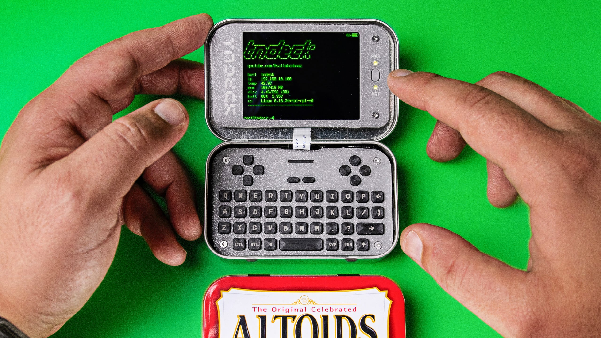

# TN Deck

Watch the build video ↓

TN Deck is a tiny handheld cyberdeck built inside an Altoids tin around the Raspberry Pi Compute Module 0. Inspired by projects like the MintyPi and other tin-based builds, it uses custom PCBs, an integrated keyboard, a small display, onboard audio, and battery power.

⚠️ In these files, R23 was changed to 2.2kΩ to fix the soft-latch issue, and C33 was added to help reset the audio DAC on power-up.

[![CC BY-NC-SA 4.0][cc-by-nc-sa-shield]][cc-by-nc-sa]

[![CC BY-NC-SA 4.0][cc-by-nc-sa-image]][cc-by-nc-sa]

[cc-by-nc-sa]: http://creativecommons.org/licenses/by-nc-sa/4.0/
[cc-by-nc-sa-image]: https://licensebuttons.net/l/by-nc-sa/4.0/88x31.png
[cc-by-nc-sa-shield]: https://img.shields.io/badge/License-CC%20BY--NC--SA%204.0-lightgrey.svg